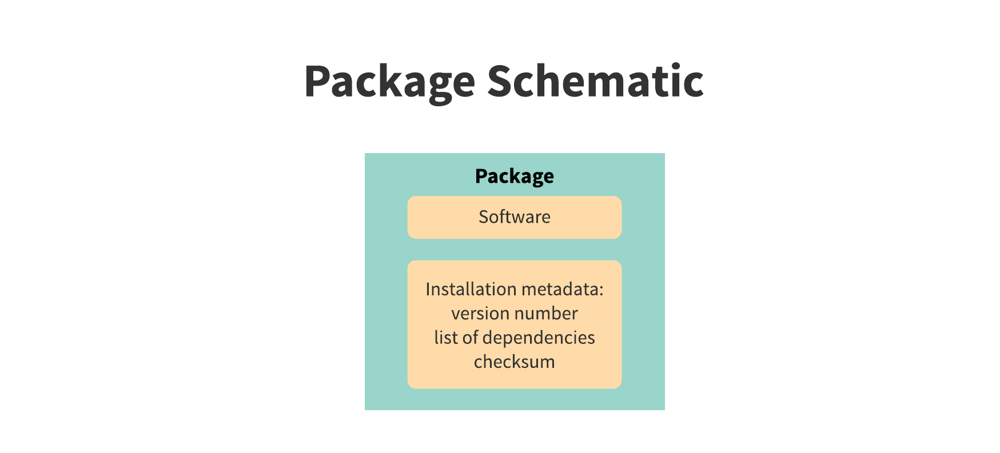
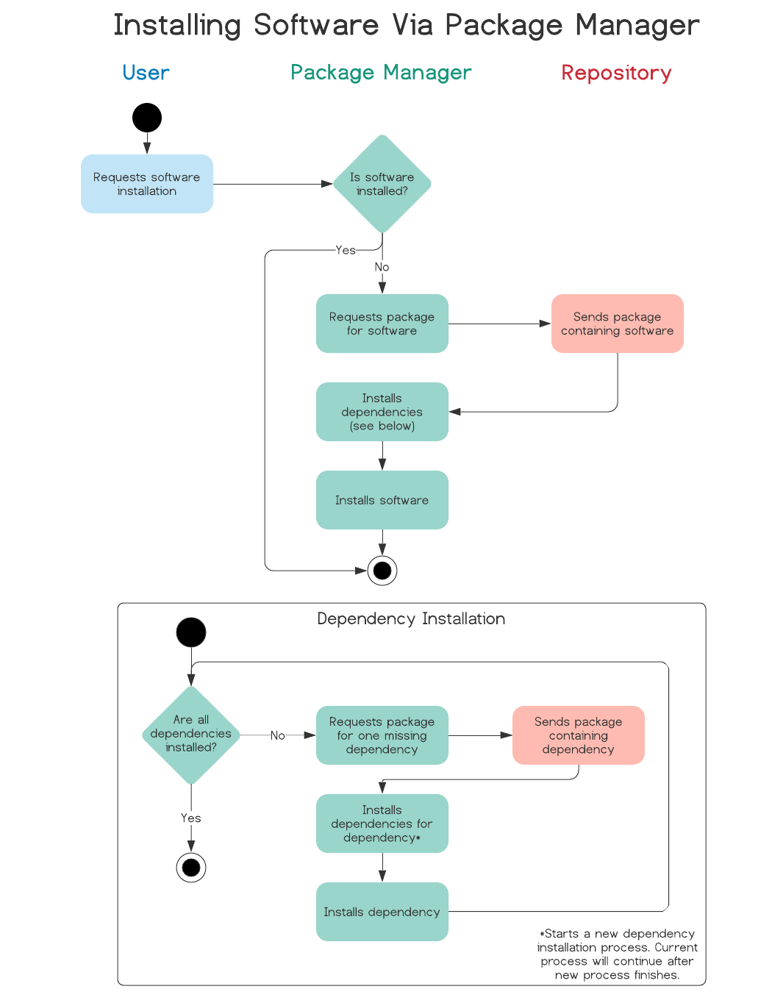
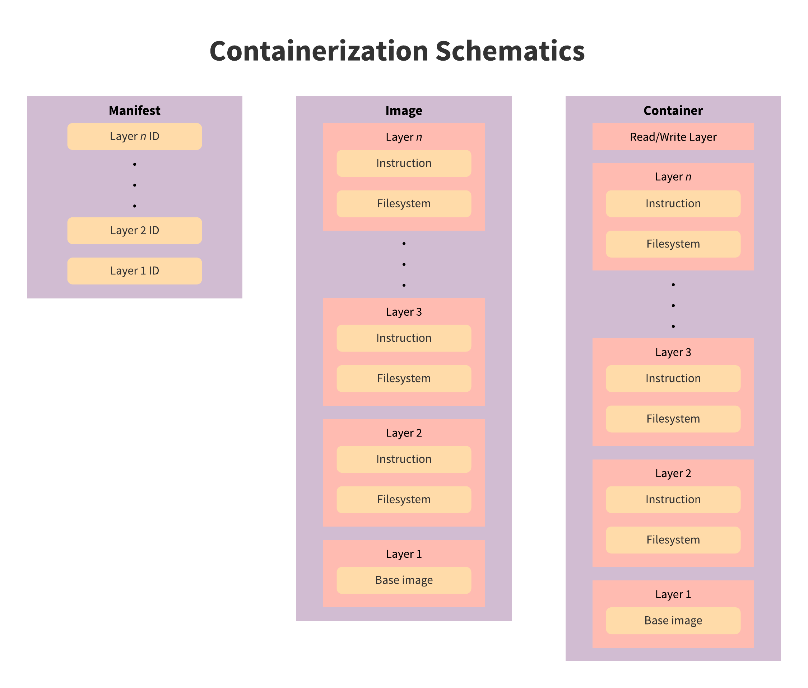
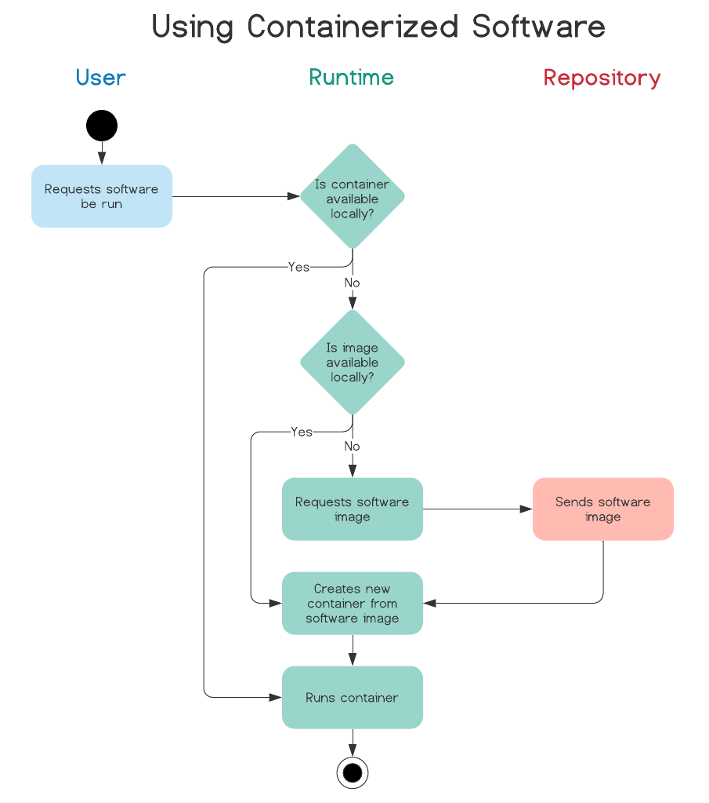

## Discussion {.page_break_before}

### Existing problems with software distribution and installation

The installation process of bioinformatics research software is typically a multi-step process, starting with the end-user locating and downloading the software. 
Next is the actual installation, during which the end-user must determine what dependencies are missing and resolve them by installing the required software[5](https://paperpile.com/c/4vBDtY/kjwlC).
Even in cases where the end-user is familiar with this process, they are typically installing on high-performance clusters where they are constrained by user-level permissions that prevent them from following standard installation procedures.

- root access limitations
- reproducibility of findings
- version conflicts
- dependency resolution

### Definitions and explanations of distribution system types
- package managers
  - definition
{#fig:package-schematic width="6in"}
{#fig:package-manager-usage width="6in"}
  - benefits for the developer
    - mature technology - higher degree of familiarity
    - allows dependency specification (including versions)
  -limitations for the developer
    - can't always use to install missing dependencies for end-user
  - benefits for the end-user
    - package size is minimal (dependencies aren't duplicated)
    - installs missing dependencies
  - limitations for the end-user
    - not always accessible (unless admin user)
    - can't install multiple versions of same software
- containerization
  - definition
{#fig:containerization-schematics width="6in"}
{#fig:container_usage width="6in"}
  - benefits for the developer
    - include specific versions of dependencies
    - known running environment
      - fewer test variables
      - reproducibility of results
  - limitations for the developer
    - learn a new system instead of focusing on research
  - benefits for the end-user
    - no installation (except possible runtime)
    - no dependency issues
    - sandbox provides computer system security
  - limitations for the end-user
    - container size
    - duplication of dependencies
    - root access requirement to install runtime
    - configuration in cluster
- centralized repositories
  - definition
  - benefits
    - known download site
    - hosting is taken of
  - limitations
    - repo specific restrictions
