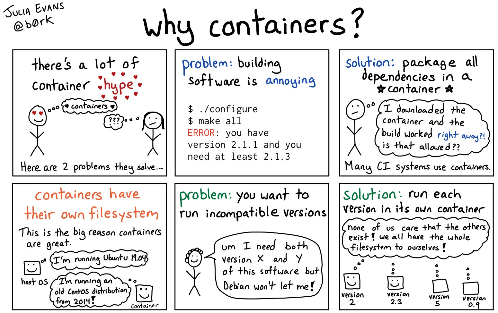

---
author-meta:
- Sharon Waymost
bibliography:
- content/manual-references.json
date-meta: '2020-07-18'
header-includes: '<!--

  Manubot generated metadata rendered from header-includes-template.html.

  Suggest improvements at https://github.com/manubot/manubot/blob/master/manubot/process/header-includes-template.html

  -->

  <meta name="dc.format" content="text/html" />

  <meta name="dc.title" content="Review of Package Managers for Bioinformatics Software Distribution" />

  <meta name="citation_title" content="Review of Package Managers for Bioinformatics Software Distribution" />

  <meta property="og:title" content="Review of Package Managers for Bioinformatics Software Distribution" />

  <meta property="twitter:title" content="Review of Package Managers for Bioinformatics Software Distribution" />

  <meta name="dc.date" content="2020-07-18" />

  <meta name="citation_publication_date" content="2020-07-18" />

  <meta name="dc.language" content="en-US" />

  <meta name="citation_language" content="en-US" />

  <meta name="dc.relation.ispartof" content="Manubot" />

  <meta name="dc.publisher" content="Manubot" />

  <meta name="citation_journal_title" content="Manubot" />

  <meta name="citation_technical_report_institution" content="Manubot" />

  <meta name="citation_author" content="Sharon Waymost" />

  <meta name="citation_author_institution" content="CS Dept, UCLA" />

  <meta name="citation_author_orcid" content="0000-0003-1176-5386" />

  <link rel="canonical" href="https://sbpw.github.io/pkg-manager-review/" />

  <meta property="og:url" content="https://sbpw.github.io/pkg-manager-review/" />

  <meta property="twitter:url" content="https://sbpw.github.io/pkg-manager-review/" />

  <meta name="citation_fulltext_html_url" content="https://sbpw.github.io/pkg-manager-review/" />

  <meta name="citation_pdf_url" content="https://sbpw.github.io/pkg-manager-review/manuscript.pdf" />

  <link rel="alternate" type="application/pdf" href="https://sbpw.github.io/pkg-manager-review/manuscript.pdf" />

  <link rel="alternate" type="text/html" href="https://sbpw.github.io/pkg-manager-review/v/2ccc4618a9c30fc332badae847745123b4e16fda/" />

  <meta name="manubot_html_url_versioned" content="https://sbpw.github.io/pkg-manager-review/v/2ccc4618a9c30fc332badae847745123b4e16fda/" />

  <meta name="manubot_pdf_url_versioned" content="https://sbpw.github.io/pkg-manager-review/v/2ccc4618a9c30fc332badae847745123b4e16fda/manuscript.pdf" />

  <meta property="og:type" content="article" />

  <meta property="twitter:card" content="summary_large_image" />

  <link rel="icon" type="image/png" sizes="192x192" href="https://manubot.org/favicon-192x192.png" />

  <link rel="mask-icon" href="https://manubot.org/safari-pinned-tab.svg" color="#ad1457" />

  <meta name="theme-color" content="#ad1457" />

  <!-- end Manubot generated metadata -->'
keywords:
- package managers
- containerization
- distribution
- docker
lang: en-US
manubot-clear-requests-cache: false
manubot-output-bibliography: output/references.json
manubot-output-citekeys: output/citations.tsv
manubot-requests-cache-path: ci/cache/requests-cache
title: Review of Package Managers for Bioinformatics Software Distribution
...

<small><em>
This manuscript
([permalink](https://sbpw.github.io/pkg-manager-review/v/2ccc4618a9c30fc332badae847745123b4e16fda/))
was automatically generated
from [sbpw/pkg-manager-review@2ccc461](https://github.com/sbpw/pkg-manager-review/tree/2ccc4618a9c30fc332badae847745123b4e16fda)
on July 18, 2020.
</em></small>

## Authors

+ **Sharon Waymost** 
    {.inline_icon}
    [0000-0003-1176-5386](https://orcid.org/0000-0003-1176-5386)
    · {.inline_icon}
    [sbpw](https://github.com/sbpw) 
  <small>
     CS Dept, UCLA
  </small>

## Abstract {.page_break_before}

## Introduction {.page_break_before}

## Discussion {.page_break_before}

### Existing problems with software distribution and installation
- root access limitations
- reproducibility of findings
- version conflicts
- dependency resolution

### Definitions and explanations of distribution system types
- package managers
  - definition
  - benefits for the developer
    - mature technology - higher degree of familiarity
    - allows dependency specification (including versions)
  -limitations for the developer
    - can't always use to install missing dependencies for end-user
  - benefits for the end-user
    - package size is minimal (dependencies aren't duplicated)
    - installs missing dependencies
  - limitations for the end-user
    - not always accessible (unless admin user)
    - can't install multiple versions of same software
- containerization
  - definition
{#fig:why-containers-comic width="5in"}
  - benefits for the developer
    - include specific versions of dependencies
    - known running environment
      - fewer test variables
      - reproducibility of results
  - limitations for the developer
    - learn a new system instead of focusing on research
  - benefits for the end-user
    - no installation (except possible runtime)
    - no dependency issues
    - sandbox provides computer system security
  - limitations for the end-user
    - container size
    - duplication of dependencies
    - root access requirement to install runtime
    - configuration in cluster
- centralized repositories
  - definition
  - benefits
    - known download site
    - hosting is taken of
  - limitations
    - repo specific restrictions

## Glossary {.page_break_before}

## Acknowledgements {.page_break_before}

## Author Contributions {.page_break_before}

## References {.page_break_before}

<!-- Explicitly insert bibliography here -->

## Tables {.page_break_before}

| Distribution System Name | URL                                      | Publication           | Type             | Licensing               |
| :----------------------- | :--------------------------------------- | :-------------------- | :--------------- | :---------------------- |
| AppImage                 | https://appimage.org                     | -                     | containerization | MIT                     |
| APT                      | https://wiki.debian.org/Apt              | -                     | package manager  | GNU GPL 2+              |
| Bioconda                 | https://bioconda.github.io               | Grüning et al, 2018   | package manager  | MIT                     |
| Bioconductor             | https://www.bioconductor.org             | Gentleman et al, 2004 | package manager  | MIT                     |
| conda                    | https://docs.conda.io/en/latest          | -                     | package manager  | 3-Clause BSD            |
| CRAN                     | https://cran.r-project.org/index.html    | -                     | package manager  | GNU GPL                 |
| Docker                   | https://www.docker.com                   | -                     | containerization | Apache 2.0              |
| Easybuild                | https://easybuilders.github.io/easybuild | Hoste et al, 2012     | package manager  | GNU GPL 2               |
| Flatpak                  | https://flatpak.org                      | -                     | containerization | LGPL                    |
| GNU Guix                 | https://www.gnu.org/software/guix        | Courtès, 2013         | package manager  | GNU AGPL                |
| Homebrew                 | https://brew.sh                          | -                     | package manager  | BSD 2-Clause Simplified |
| pip                      | https://pypi.org/project/pip             | -                     | package manager  | MIT                     |
| Singularity              | https://sylabs.io                        | -                     | containerization | 3-Clause BSD            |
| Snap                     | https://snapcraft.io                     | -                     | containerization | propriertary            |
| Spack                    | https://spack.io                         | Gamblin et al, 2015   | package manager  | MIT or Apache           |
| Vagrant                  | https://www.vagrantup.com                | -                     | virtual machine  | MIT                     |
| yum                      | http://yum.baseurl.org                   | -                     | package manager  |                         |
| Zero Install             | https://0install.net                     | -                     | package manager  | GNU LGPL 2.1+           | {#tbl:basic-info}

| Distribution System Name | Supported Operating Systems | Supported Languages | Root to Install | Root to Run |
| :----------------------- | :-------------------------- | :------------------ | :-- | :-- |
| AppImage                 | Linux                       | any                 | n/a | no  |
| APT                      | Debian, Ubuntu              | any                 | yes | yes |
| Bioconda                 | Linux, macOS, Windows       | any                 | no  | no  |
| Bioconductor             | Linux, macOS, Windows       | R                   | no  | no  |
| conda                    | Linux, macOS, Windows       | any                 | no  | no  | 
| CRAN                     | Linux, macOS, Windows       | R                   | no  | no  |
| Docker                   | Linux, macOS, Windows       | any                 | yes | no  |
| Easybuild                | Linux                       | any                 | no  | no  |
| Flatpak                  | Linux                       | any                 | no  | no  |
| GNU Guix                 | Linux                       | any                 | no  | no  |
| Homebrew                 | Linux, macOS                | any                 | no  | no  |
| pip                      | Linux, macOS, Windows       | Python              | no  | no  |
| Singularity              | Linux, macOS                | any                 | yes | no  |
| Snap                     | Linux                       | any                 | yes | no  |
| Spack                    | Linux, macOS                | any                 | no  | no  |
| Vagrant                  | Linux, macOS, Windows       | any                 | yes |     |
| yum                      | Linux, macOS, Windows       | any                 | no  | yes |
| Zero Install             | Linux, macOS, Windows       | any                 | no  | no  | {#tbl:features} 

| Distribution System Name | First Release | Latest Release | Age | Number of Releases | Number of Tools | Number of Bio Tools |
| :----------------------- | :------------ | :------------- | --: | ---: | ---: | ---: |
| AppImage                 | 2014-01-24    | 2020-06-01     | 7   | 121  | | |
| APT                      | 1998-03-31    | 2020-05-08     | 22  | 362  | | |
| Bioconda                 | 2014-01-24    | 2016-09-06     | 7   | 39   | | | 
| Bioconductor             | 2002-05-01    | 2020-04-28     | 17  | 37   | | |
| conda                    | 2014-01-24    | 2020-04-13     | 6   | 261  | | |
| CRAN                     | 1997-04-23    | 2020-02-29     | 22  | 29   | | |
| Docker Engine            | 2013-03-23    | 2020-06-01     | 7   | 121  | | |
| Easybuild                | 2012-11-09    | 2020-04-14     | 7   | 51   | | |
| Flatpak                  | 2015-03-23    | 2020-04-03     | 5   | 128  | | |
| GNU Guix                 | 2012-07-07    | 2020-04-15     | 7   | 23   | | |
| Homebrew                 | 2009-05-20    | 2020-05-04     | 10  | 155  | | |
| pip                      | 2009-01-20    | 2020-04-28     | 11  | 81   | | |
| Singularity              | 2012-07-07    | 2020-04-15     | 7   | 23   | | |    
| snapd                    | 2014-12-09    | 2020-07-15     | 5   | 232  | | |
| Spack                    | 2014-07-09    | 2020-04-15     | 5   | 27   | | |
| Vagrant                  |               |                |     |      | | | 
| yum    (CHECK RED HAT)   | 2002-06-08    | 2011-06-28     | 18  | 221  | | |
| Zero Install             | 2005-02-04    | 2020-05-04     | 15  | 145  | | | {#tbl:popularity}

| Distribution System Name | Official Repository Name    | Repository URL | 
| :----------------------- | :-------------------------- | :------------- |
| AppImage                 | AppImageHub                 | https://appimage.github.io/apps |
| APT                      | -                           | -              |
| Bioconda                 | bioconda channel            | https://github.com/bioconda/bioconda-recipes |
| Bioconductor             | -                           | https://www.bioconductor.org/packages/release/BiocViews.html#___Software |
| conda                    | -                           | https://repo.anaconda.com/pkgs |
| CRAN                     | -                           | https://cran.r-project.org/web/packages/available_packages_by_name.html |
| Docker                   | Docker Hub                  | https://hub.docker.com |
| Easybuild                |                             |                |
| Flatpak                  | Flathub                     | https://flathub.org/ |   
| GNU Guix                 | -                           | https://guix.gnu.org/packages |
| Homebrew                 | Homebrew Formulae           | https://formulae.brew.sh |
| pip                      | Python Package Index (PyPI) | https://pypi.org |
| Singularity              | Singularity Hub             | https://singularity-hub.org |
| Snap                     | Snapcraft                   | https://snapcraft.io/store |
| Spack                    | -                           | -              |
| Vagrant                  | Vagrant Cloud               | https://app.vagrantup.com/boxes/search |
| yum                      | -                           | -              |
| Zero Install             | -                           | https://apps.0install.net/ | {#tbl:official-repositories} 
 

